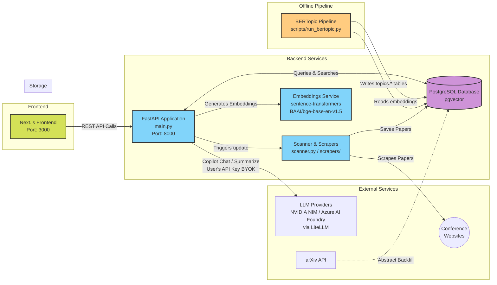

# Cosmospaper Architecture

This diagram illustrates the high-level architecture of the `cosmospaper` project.

## Key Components:
- **Frontend (Next.js)**: A React 19 / Next.js 16 application on port 3000. Handles paper search, bookmarks, trend visualizations, and the AI Copilot chat panel.
- **Backend (FastAPI)**: The core API server (`main.py`) on port 8000 handling filtering, semantic search, Copilot endpoints, and BERTopic trend queries. Includes rate limiting via slowapi.
- **Scrapers**: A background task system (`scanner.py` and the `scrapers/` directory) that fetches paper metadata and abstracts from 15+ conference websites.
- **Embeddings**: Local `sentence-transformers` model (BAAI/bge-base-en-v1.5, 768-dim) generates embeddings on the server — no external API needed.
- **Database**: PostgreSQL with `pgvector` for storing paper metadata and performing cosine-similarity semantic search.
- **BERTopic Pipeline**: An offline GPU script (`scripts/run_bertopic.py`) that clusters 50k+ paper embeddings into ~150 topics. Results are stored in `topics.*` tables and served by the `/api/trends/*` endpoints.
- **LLM Providers (BYOK)**: The AI Copilot routes user requests through LiteLLM to NVIDIA NIM or Azure AI Foundry. Users provide their own API key — it is never stored on the server.
