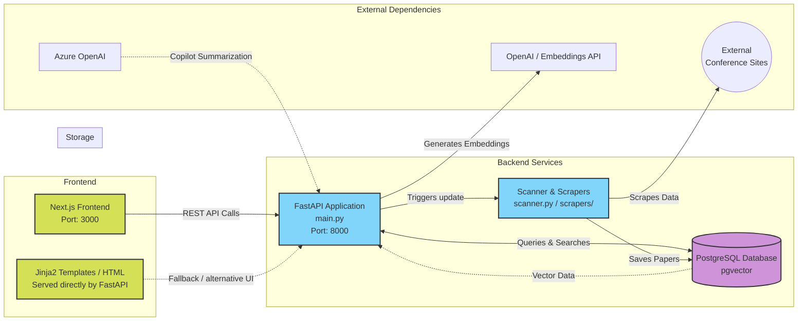

# Cosmospaper Architecture

This diagram illustrates the high-level architecture of the `cosmospaper` project.

## Key Components:
- **Frontend**: A modern Next.js application running on port 3000 that communicates with the API. There is also a fallback HTML/Jinja2 template system served directly by FastAPI.
- **Backend (FastAPI)**: The core API server (`main.py`) running on port 8000 handling search, filtering, and semantic search requests.
- **Scrapers**: A background task system (`scanner.py` and the `scrapers/` directory) that fetches paper data from various conference websites.
- **Database**: A PostgreSQL database utilizing `pgvector` for storing paper metadata and performing semantic similarity searches using embeddings.
- **Embeddings/AI**: Integration with OpenAI/Azure OpenAI for generating text embeddings for semantic search and summarizing papers.
